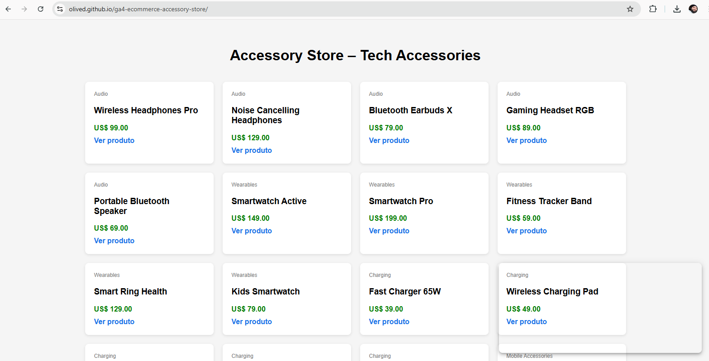
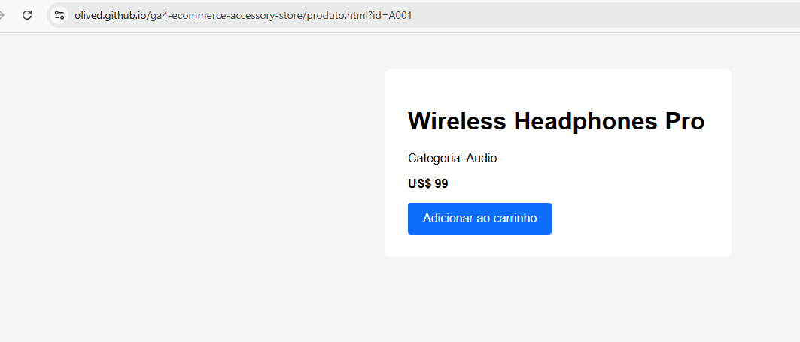
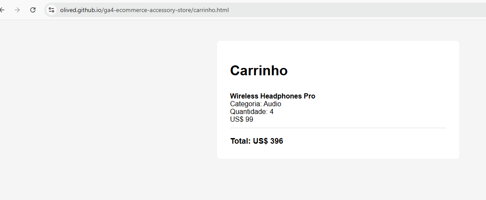
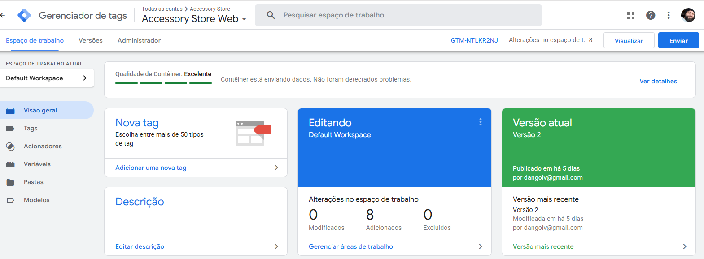
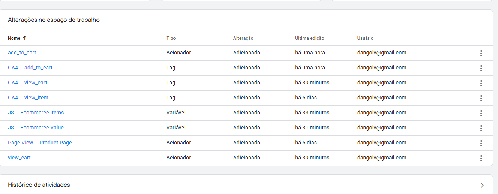
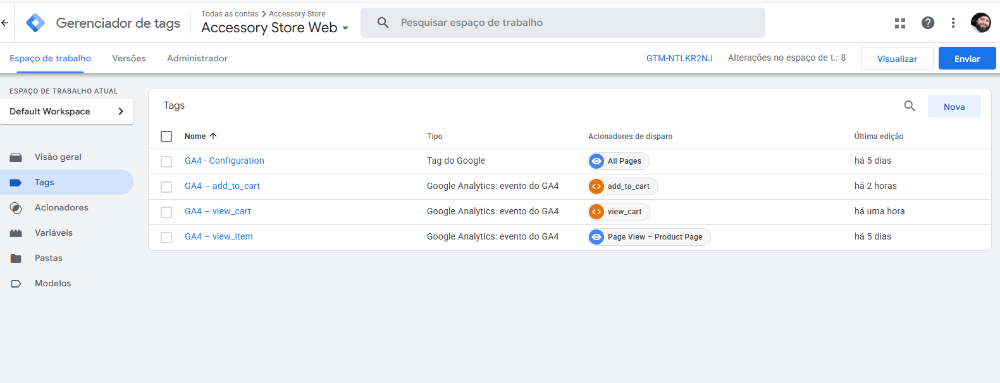
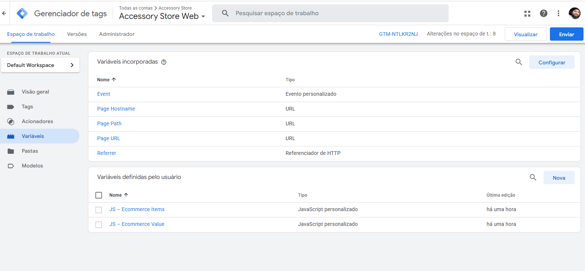

# GA4 E-commerce Tracking Portfolio – Accessory Store

## Overview
This project is a **portfolio implementation of GA4 e-commerce tracking** for a fictional online store (Accessory Store – Tech Accessories).
It demonstrates how to design, implement, validate, and document a complete tracking setup using **Google Tag Manager (GTM)**, **Google Analytics 4 (GA4)**, and **Looker Studio**.

The entire solution was built from scratch, including:
- Front-end pages (HTML + JavaScript)
- Custom `dataLayer` events
- GTM configuration
- GA4 validation and debugging

---

## Demo Website
**Live Demo:**  
https://olived.github.io/ga4-ecommerce-accessory-store/

### Home – Product Listing




### Product Detail Page


### Cart Page


---

## Tracking Architecture
```
User
 ↓
Website (HTML + JavaScript)
 ↓
dataLayer.push()
 ↓
Google Tag Manager (GTM)
 ↓
Google Analytics 4 (GA4)
 ↓
Looker Studio (Analytics Layer)
```

---

## GA4 E-commerce Events Implemented
All events follow the **official GA4 E-commerce schema**, including the `items[]` array.

| Event Name       | Description                         |
|------------------|-------------------------------------|
| view_item_list   | Product list impression             |
| view_item        | Product detail view                 |
| add_to_cart      | Add product to cart                 |
| view_cart        | Cart visualization                  |

---

## Google Tag Manager (GTM)

### Components Created
- **Triggers**
  - Custom events based on `dataLayer`
- **Tags**
  - GA4 Event Tags for each e-commerce event
- **Custom JavaScript Variables**
  - `JS – Ecommerce Items`
  - `JS – Ecommerce Value`

### GTM – Tags Overview


### GTM – Triggers


### GTM – Variables


---

## Validation & Debugging

The implementation was validated using:
- Google Tag Assistant
- GTM Preview Mode
- GA4 DebugView

### Tag Assistant – view_cart Event


### GA4 DebugView


---

## Google Analytics 4 (GA4)

### GA4 Property Overview


All e-commerce events are correctly received and processed in GA4, following recommended best practices.

---

## Skills Demonstrated
- GA4 E-commerce Tracking (Standard Schema)
- Google Tag Manager (Advanced Setup)
- dataLayer Design
- Front-end Tracking (HTML + JavaScript)
- Debugging & Validation
- Analytics Documentation

---

## Notes
- This is a **portfolio project** using fictional data and products.
- No real transactions or users are involved.
- The focus is on **tracking architecture, accuracy, and documentation quality**.

---

## Author
**Daniel Oliveira**  
Analytics & Data Engineering Portfolio
